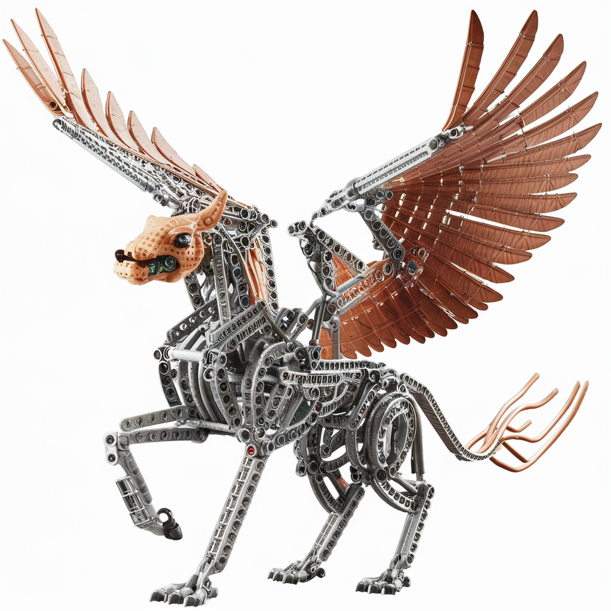

# Hippogriff

[](https://pypi.python.org/pypi/hippogriff)


This repository implements Hawk and Griffin blocks from [Griffin: Mixing Gated Linear Recurrences with Local Attention for Efficient Language Models](https://arxiv.org/abs/2402.19427v1) using [Accelerated Scan](https://github.com/proger/accelerated-scan) and [Flash Attention](https://github.com/Dao-AILab/flash-attention) for PyTorch.

```
pip install hippogriff
```


